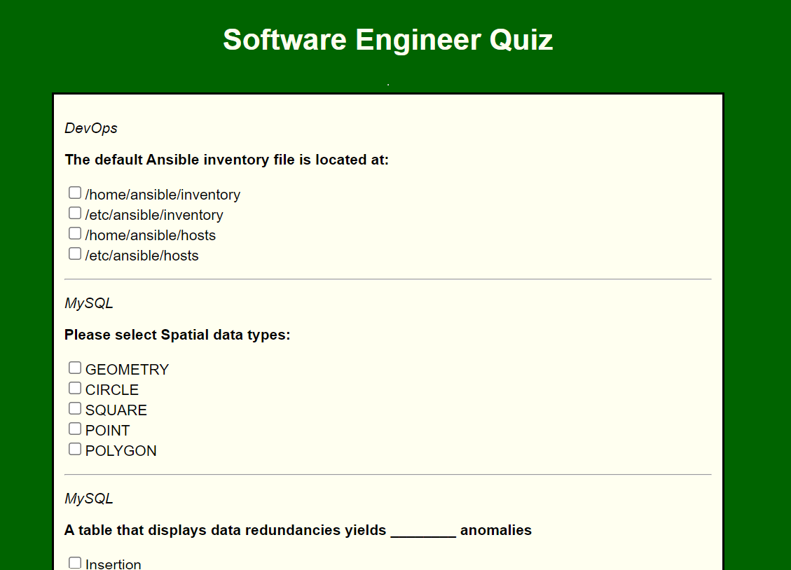
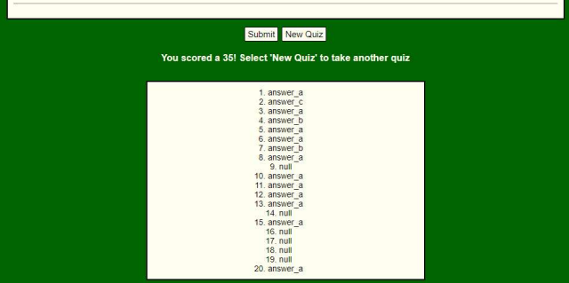

# <h1 align="center">Software Engineer Quiz</h1>

  
 

## 📝 Description
This is a single-page application with a quiz for Software Engineers.  When the page opens, 20 questions will be generated.  The user must then answer the questions and hit the submit button at the bottom of the page to see their score.  The user will then have the chance to view the answers to the quiz and generate a new quiz.

While studying at General Assembly, I created this bonus project by myself to learn TypeScript with the other technologies taught in the course.

Due to the fact that I did not use a bundler (I created this Express app from scratch) the use of the dotenv library becomes quite complex with TypeScript.  After speaking with a couple of my instructors, it was determined that this project could be run with the set up below.

## 🖼️ Screenshots

 
 📊 The Quiz

 
 | Description | Screenshot |
 |------------ | ------------|
 | <h3 align="center">Top of the Page</h3> | 
 | <h3 align="center">Finished Quiz</h3> | 
 

# Technologies Used

## ⚛️ Getting Started
### 📲 Instructions

API Setup

1. Navigate to the website https://quizapi.io/ and generate your own API key.
 
2. In the terminal, before running the server, enter the command 'export QUIZ_API_KEY=[YOUR API KEY]'.
 
3. Then, start the server as usual.

Taking the quiz

1. The API will generate 20 questions.
 
2. Answer each question by clicking one of the boxes.
 
3. Submit the quiz at the end the see your scores and the answers.

4. Select "New Quiz" to take another quiz.

# ⏭️ Next Steps

- [ ] Find and fix possible bugs
- [ ] Refactor code
- [ ] Recreate project using a bundler so that users do not need to generate their own API key
- [ ] Modify the answers to be more readable